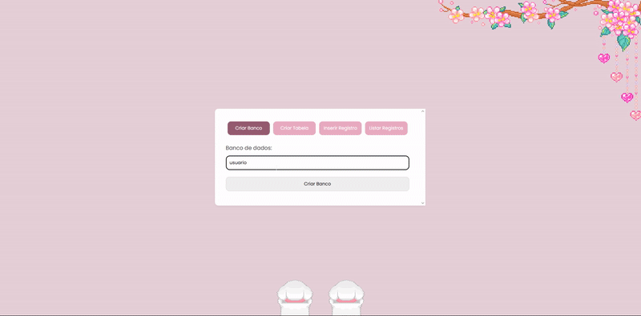

# 📊 Lily's Database - Trabalho Sistemas Distribuídos
Um painel web para gerenciamento de bancos de dados simples, com funcionalidades essenciais.

## ✨ Funcionalidades
- 🗃️ Criar bancos de dados
- 📝 Criar tabelas com campos personalizados
- ➕ Inserir registros nas tabelas
- 🔍 Listar e visualizar dados
- 🖥️ Interface web

## 🛠️ Tecnologias Utilizadas
- Node.js
- Express
- Cors
- MySQL2
- Javascript
- HTML/CSS

## 📸 Demonstração

